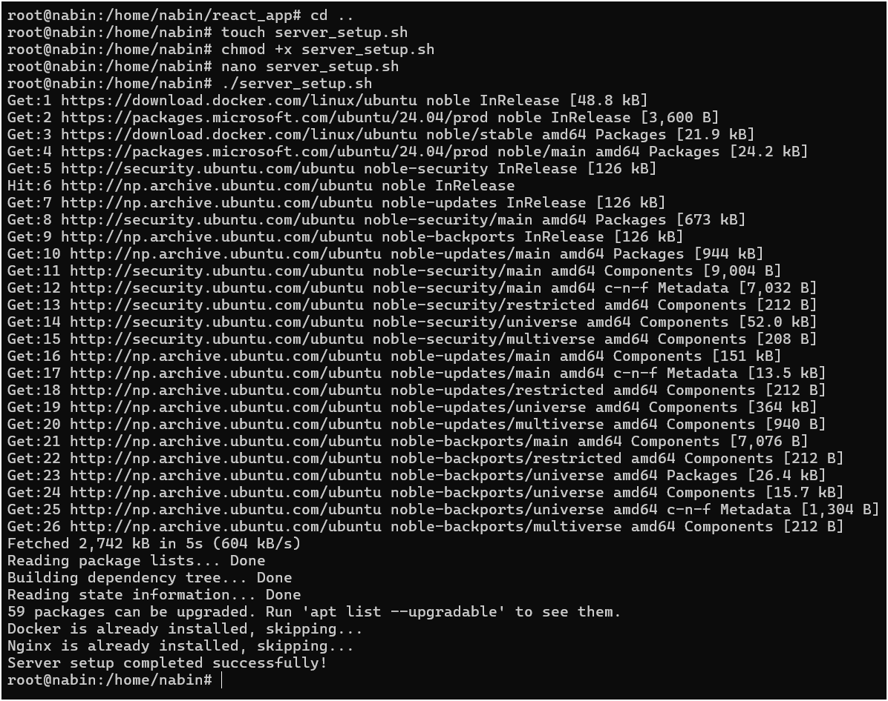
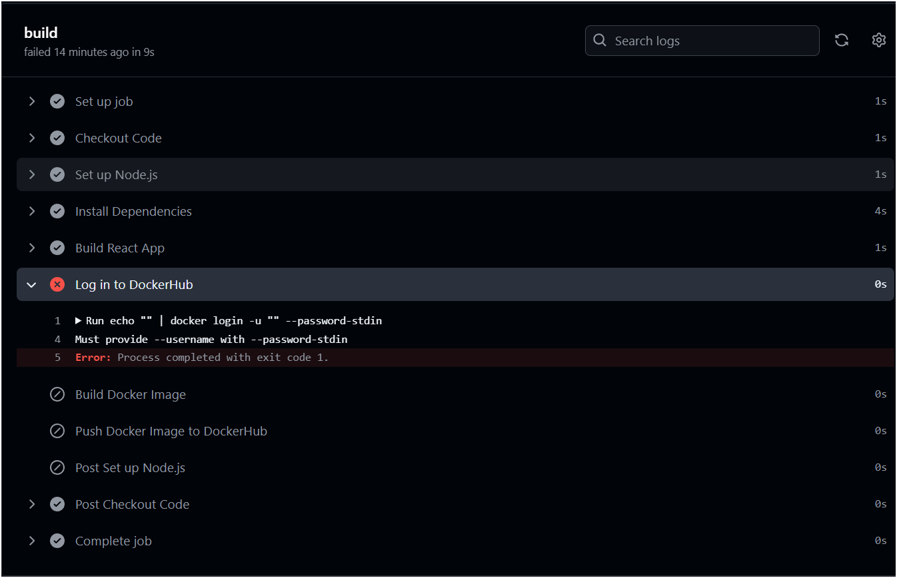

# Task-1: Writing CI/CD Deployment Task Using GitHub Runner (Manual Process)
*Note: Automated script is given after manual  the process*
## 1. Setting up server (Writing a bash script)
### a. Setting up docker on a linux machine
- Created a file named *docker_install.sh*
- Written following commands to the file
<pre> # Add Docker's official GPG key:
sudo apt-get update
sudo apt-get install ca-certificates curl
sudo install -m 0755 -d /etc/apt/keyrings
sudo curl -fsSL https://download.docker.com/linux/ubuntu/gpg -o /etc/apt/keyrings/docker.asc
sudo chmod a+r /etc/apt/keyrings/docker.asc

# Add the repository to Apt sources:
echo \
  "deb [arch=$(dpkg --print-architecture) signed-by=/etc/apt/keyrings/docker.asc] https://download.docker.com/linux/ubuntu \
  $(. /etc/os-release && echo "${UBUNTU_CODENAME:-$VERSION_CODENAME}") stable" | \
  sudo tee /etc/apt/sources.list.d/docker.list > /dev/null
sudo apt-get update
</pre>
- Made the file executable
<pre>chmod +x docker_install.sh</pre>
- Ran the the following command to install the docker
<pre>./docker_install.sh</pre>
- Installed the docker packages using following
<pre>sudo apt-get install docker-ce docker-ce-cli containerd.io docker-buildx-plugin docker-compose-plugin</pre>
- Now the docker has been successfully installed in our linux machine
- We can check the docker availability
<pre>
docker --vesion
docker run hello-world
</pre>

### c. Installing Nginx
- Installed Nginx server using following commands
<pre>
sudo apt update
sudo install nginx
</pre>
- Successful installation of nginx
 
- Terminal view

## 2. Dependency setup (CI)
a. Installed Project Dependencies using:
<pre>npm install</pre>

Dockerfile
<pre>
FROM node:20-alpine

WORKDIR /app

COPY package*.json .

RUN npm install

COPY . .

EXPOSE 5173

CMD ["npm", "run", "dev"]
</pre>
b. Built the docker image using command
<pre>dockre build -t react-app</pre>
- Ran the docker container
<pre>docker run -p 5173:5173 react-app</pre>

- Docker Push

<pre>
docker tag react-app nabinpurney03/ract-app
docker push nabinpurbey03/react-app
</pre>

## 3. Project setup (CD)
a. Pulling the latest Docker images from the registry using following command
<pre>docker pull nabinpurbey03/react-app</pre>
b. Deploying the application to make it live using following command
<pre>docker run --rm -d -p 5173:5173 nabinpurbey03/react-app</pre>
- Web View

- Terminal View

# Bash Script to automate all the above process (Automated Script)
<pre>
#!/bin/bash
sudo apt update -y

if ! command -v docker &> /dev/null
then
    echo "Docker not found! Installing..."
    sudo apt install -y docker.io
    sudo systemctl enable docker
    sudo systemctl start docker
else
    echo "Docker is already installed, skipping..."
fi

if ! command -v nginx &> /dev/null
then
    echo "Nginx not found! Installing..."
    sudo apt install -y nginx
    sudo systemctl enable nginx
    sudo systemctl start nginx
else
    echo "Nginx is already installed, skipping..."
fi

NGINX_CONFIG="/etc/nginx/sites-available/default"
sudo bash -c "cat > $NGINX_CONFIG"
server {
    listen 80;
    server_name _;

    location / {
        proxy_pass http://localhost:8000;
        proxy_set_header Host \$host;
        proxy_set_header X-Real-IP \$remote_addr;
    }
}
EOL

sudo systemctl restart nginx

echo "Server setup completed successfully!"
</pre>
- Preview

# Github workflow error
<pre>
name: CI/CD Pipeline

on:
  push:
    branches:
      - main

jobs:
  build:
    runs-on: ubuntu-latest

    steps:
      - name: Checkout Code
        uses: actions/checkout@v3

      - name: Set up Node.js
        uses: actions/setup-node@v3
        with:
          node-version: '20'

      - name: Install Dependencies
        run: npm install

      - name: Build React App
        run: npm run build
        working-directory: ./

      - name: Log in to DockerHub
        run: echo "${{ secrets.DOCKER_PASSWORD }}" | docker login -u "${{ secrets.DOCKER_USERNAME }}" --password-stdin #ERROR

      - name: Build Docker Image
        run: docker build -t nabinpurbey03/react-app:latest .

      - name: Push Docker Image to DockerHub
        run: docker push nabinpurbey03/react-app:latest

  deploy:
    runs-on: self-hosted

    needs: build
    steps:
      - name: Pull Latest Docker Image
        run: docker pull nabinpurbey03/react-app:latest

      - name: Stop and Remove Old Container
        run: docker rm -f app-react-app || true

      - name: Run New Container
        run: docker run -d -p 5173:5173 --name react-app nabinpurbey03/react-app:latest

</pre>
- Preview

---
# Reference
[Linux Machine Download](https://ubuntu.com/download)
 
[Writing a Docker file](https://docs.docker.com/get-started/docker-concepts/building-images/writing-a-dockerfile/)
 
[Docker Installation in Ununtu Server](https://docs.docker.com/engine/install/ubuntu/)
 
[Nginx Installation in Ubuntu](https://nginx.org/en/linux_packages.html#Ubuntu)
 
[Markdown Cheat Sheet](https://www.markdownguide.org/cheat-sheet/)
 
[Ansible Ideas](https://docs.ansible.com/?extIdCarryOver=true&sc_cid=701f2000001OH7EAAW)
 
[Ansible Automation](https://docs.redhat.com/en/documentation/red_hat_ansible_automation_platform/2.5)
 
[GitHub Actions Tutorial](https://www.youtube.com/watch?v=R8_veQiYBjI)
 
[Ansible Tutorial](https://www.youtube.com/watch?v=y2TSR7p3N0M)
 
[Github Workflows Tutorial](https://www.youtube.com/watch?v=ookIfjc8dW0)
 
[Nginx Configuration Tutorial](https://www.youtube.com/watch?v=C5kMgshNc6g)
 
`more...`
