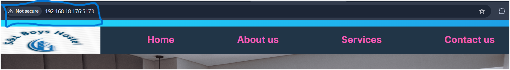

# Task-1: Writing CI/CD Deployment Task Using GitHub Runner
## 1. Setting up server (Writing a bash script)
### a. Setting up docker on a linux machine
- Created a file named *docker_install.sh*
- Written following commands to the file
<pre> # Add Docker's official GPG key:
sudo apt-get update
sudo apt-get install ca-certificates curl
sudo install -m 0755 -d /etc/apt/keyrings
sudo curl -fsSL https://download.docker.com/linux/ubuntu/gpg -o /etc/apt/keyrings/docker.asc
sudo chmod a+r /etc/apt/keyrings/docker.asc

# Add the repository to Apt sources:
echo \
  "deb [arch=$(dpkg --print-architecture) signed-by=/etc/apt/keyrings/docker.asc] https://download.docker.com/linux/ubuntu \
  $(. /etc/os-release && echo "${UBUNTU_CODENAME:-$VERSION_CODENAME}") stable" | \
  sudo tee /etc/apt/sources.list.d/docker.list > /dev/null
sudo apt-get update
</pre>
- Made the file executable
<pre>chmod +x docker_install.sh</pre>
- Ran the the following command to install the docker
<pre>./docker_install.sh</pre>
- Installed the docker packages using following
<pre>sudo apt-get install docker-ce docker-ce-cli containerd.io docker-buildx-plugin docker-compose-plugin</pre>
- Now the docker has been successfully installed in our linux machine
- We can check the docker availability
<pre>
docker --vesion
docker run hello-world
</pre>

### c. Installing Nginx
- Installed Nginx server using following commands
<pre>
sudo apt update
sudo install nginx
</pre>
- Successful installation of nginx
 
- Terminal view

## 2. Dependency setup (CI)
a. Installed Project Dependencies using:
<pre>npm install</pre>

Dockerfile
<pre>
FROM node:20-alpine

WORKDIR /app

COPY package*.json .

RUN npm install

COPY . .

EXPOSE 5173

CMD ["npm", "run", "dev"]
</pre>
b. Built the docker image using command
<pre>dockre build -t react-app</pre>
- Ran the docker container
<pre>docker run -p 5173:5173 react-app</pre>

- Docker Push

<pre>
docker tag react-app nabinpurney03/ract-app
docker push nabinpurbey03/react-app
</pre>

## 3. Project setup (CD)
a. Pulling the latest Docker images from the registry using following command
<pre>docker pull nabinpurbey03/react-app</pre>
b. Deploying the application to make it live using following command
<pre>docker run --rm -d -p 5173:5173 nabinpurbey03/react-app</pre>
- Web View

- Terminal View

